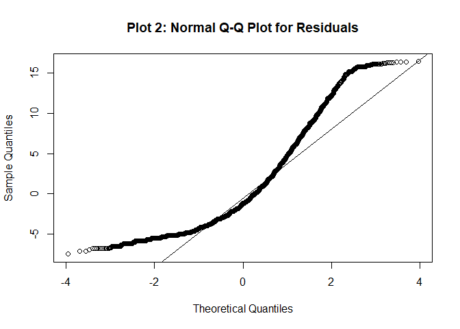
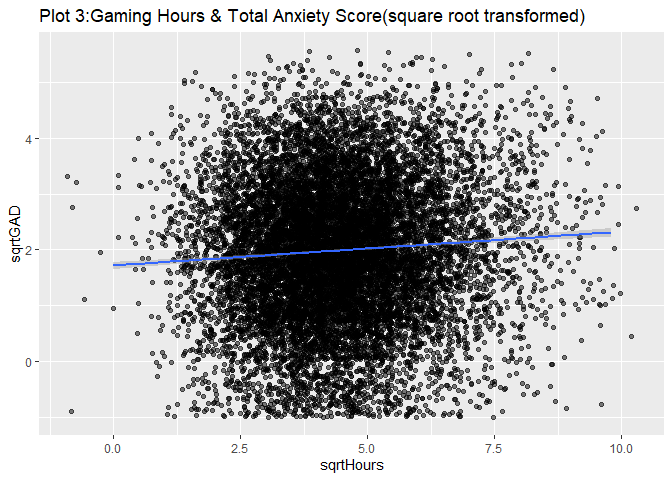
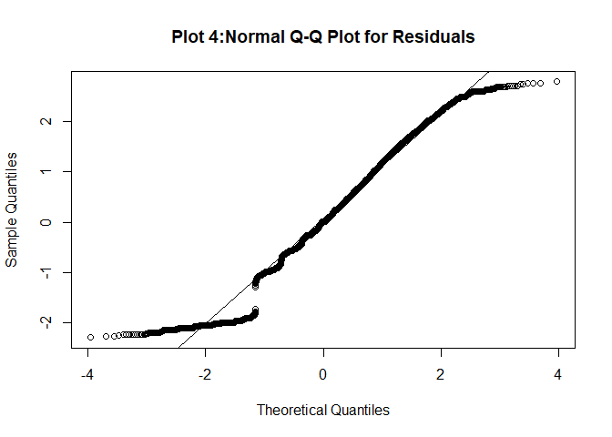
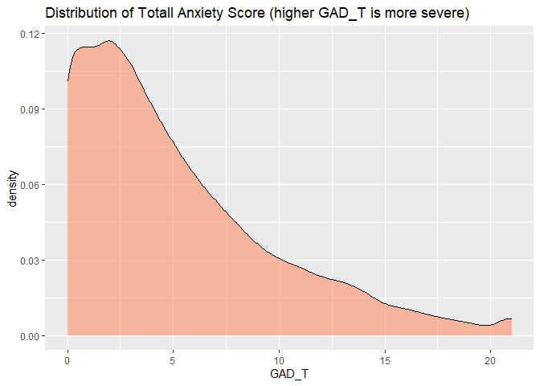
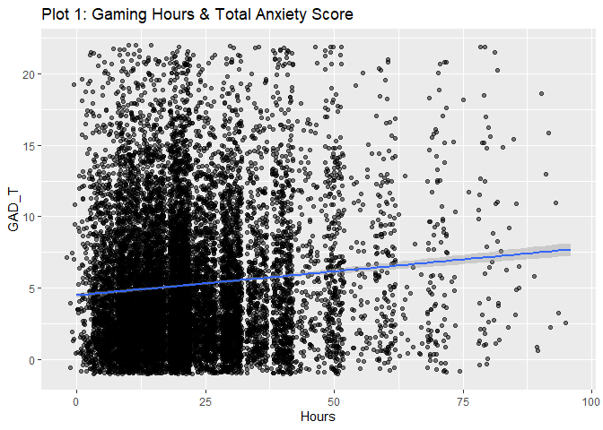
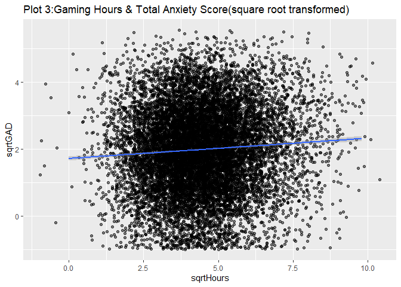

Final Project
================
Yu Zhang
2022-12-16

# Introduction

## Introduce the dataset and question

    Occasional anxiety, as a component of human emotions, is a usual
part of life. People worry about different problems. But anxiety
disorder involves more than temporary worry or fear. It is a cluster of
mental disorders characterized by significant and uncontrollable
feelings of anxiety and fear such that a person’s social, occupational,
and personal function are significantly impaired.  
    In recent years many published studies investigated potential
effects of playing video games toward anxiety disorder. Most of them
argued that playing video games provides significant benefits for
mitigating anxiety disorder. Considering that some of these studies
might be funded by the flourishing gaming industry, I doubt about the
relationship between playing video games and anxiety disorder founded by
existing studies. Hence, my question is that will playing video games
with high intensity will increase the risk of having anxiety disorder? I
will use the “Online Gaming Anxiety Data” dataset to investigate my
question.  
    The “Online Gaming Anxiety Data” that I use is a dataset consists of
data collected as a part of a survey among gamers worldwide. The dataset
consists of 55 columns of variables and 13464 rows of observations which
provide information of each observation about his/her gaming-life
pattern, responses to psychology questions, and personal information. It
can be found on
<https://www.kaggle.com/datasets/divyansh22/online-gaming-anxiety-data>.

## Exploratory data analysis

   In this dataset, I mainly focus on two variables. The first is the
Generalized Anxiety Disorder (GAD) score, which is an indicator of the
risk of having anxiety disorder. The second is the gaming hours per
week, which is an indicator of the gaming intensity. For the GAD score,
I add up the scores of all seven questions for each subject and yield a
variable called “GAD_T”, which ranges from 0 to 21. The “GAD_T” could be
used as an indicator of anxiety level and a higher “GAD_T” score
indicate more anxiety.  
   For exploratory data analysis, I clean the data by removing subjects
with NA values. I also remove 31 subjects with gaming hours more than
100 hours per week because game more than 100 hours per week seems
unrealistic. I plot the distribution of the gaming hours per week and
total “GAD_T” score. From the graphs, both distributions are right
skewed. The distribution of weekly gaming hours is centered from 10 to
25 hours per week. And most subjects reported a relatively low anxiety
score.

<!-- --><!-- -->

## Method

   In this project, I will perform linear regression model analyses and
association test analyses to investigate my problem. For linear
regression analyses, I will try to model the anxiety scores in terms of
weekly gaming hours. If a robust linear regression is found, the slope
of the model will answer my question. If high gaming intensity increase
the risk of having anxiety disorder, the slope will be positive and vice
versa. For association test analyses, I will put anxiety scores and
weekly gaming hours into categories. By constructing two-way tables for
both observe values and expected values, I can perform a Pearson’s chi
square test of independence to see if there is an association between
gaming intensity and the risk of having anxiety disorder.

# Result

   First of all, I use simple linear regression to model anxiety scores
in terms of weekly gaming hours trying to find if they are linearly
associated with each other. I also plot the fitted line on the scatter
plot of GAD_T vs. Hours. But since both weekly gaming hours and anxiety
scores are discrete variables, using regular scatter plot would lead to
a problem that many data points cover each other. Hence, I use
“geom_jitter” function to create random fluctuation on each data point
for better visualization (Plot 1).

    ## 
    ## Call:
    ## lm(formula = GAD_T ~ Hours, data = dfc)
    ## 
    ## Residuals:
    ##    Min     1Q Median     3Q    Max 
    ## -7.495 -3.491 -1.152  2.317 16.451 
    ## 
    ## Coefficients:
    ##             Estimate Std. Error t value Pr(>|t|)    
    ## (Intercept) 4.482324   0.077355   57.95   <2e-16 ***
    ## Hours       0.033474   0.003077   10.88   <2e-16 ***
    ## ---
    ## Signif. codes:  0 '***' 0.001 '**' 0.01 '*' 0.05 '.' 0.1 ' ' 1
    ## 
    ## Residual standard error: 4.68 on 13401 degrees of freedom
    ## Multiple R-squared:  0.008752,   Adjusted R-squared:  0.008678 
    ## F-statistic: 118.3 on 1 and 13401 DF,  p-value: < 2.2e-16

    ## `geom_smooth()` using formula = 'y ~ x'

<!-- --><!-- -->

   The result of this simple linear regression can be expressed as
$$ GAD\underline{}T=4.4588+0.0343*Hours $$ The intercept 4.4588 can be
interpreted as when the weekly gaming hour is 0, the estimated mean of
total anxiety score is 4.4588. And the slope 0.0343 can be interpreted
as for one-hour increase in weekly gaming hours, the total anxiety score
will increase 0.0343 on average. The slope of this model, which
indicates a positive relationship between weekly gaming hours and more
anxiety, is statistically significant with p-value less than 0.05, but
its practical significance is not very strong. The value of this slope
is 0.0343, and recall that the maximum of weekly gaming hours is 100,
which means that even with highest weekly gaming hours, the anxiety
scores, which range from 0 to 21, only about 3.4 points higher than that
with 0 weekly gaming hour on average. I also plot a normal q-q plot for
residuals (plot 2). It is obvious that the residuals are not normal,
which indicates that the regression is not robust. Hence, further
analysis is needed.  
   From Exploratory data analysis, I knew that both of weekly gaming
hours and total anxiety scores are right skewed. So, an transformation
of the data may make the linear model better. Considering both variables
are less than 100, I choose the square root transformation for both
variables. I perform simple linear regression using transformed data and
plot them over the scatter plot again (Plot 3).

    ## 
    ## Call:
    ## lm(formula = sqrtGAD ~ sqrtHours, data = df2)
    ## 
    ## Residuals:
    ##     Min      1Q  Median      3Q     Max 
    ## -2.2892 -0.6323  0.0143  0.7706  2.7819 
    ## 
    ## Coefficients:
    ##             Estimate Std. Error t value Pr(>|t|)    
    ## (Intercept) 1.715045   0.033220  51.627   <2e-16 ***
    ## sqrtHours   0.060521   0.007176   8.434   <2e-16 ***
    ## ---
    ## Signif. codes:  0 '***' 0.001 '**' 0.01 '*' 0.05 '.' 0.1 ' ' 1
    ## 
    ## Residual standard error: 1.123 on 13401 degrees of freedom
    ## Multiple R-squared:  0.00528,    Adjusted R-squared:  0.005206 
    ## F-statistic: 71.13 on 1 and 13401 DF,  p-value: < 2.2e-16

    ## `geom_smooth()` using formula = 'y ~ x'

<!-- --><!-- -->

    The result can be expressed as
$$ \sqrt{GAD\underline{}T}=1.7103+0.0613\sqrt{Hours} $$ The intercept
1.7103 can be interpreted as when the weekly gaming hour is 0, the
estimated mean of square root of total anxiety score is 1.7103. And the
slope 0.0613 can be interpreted as for one-unit increase in square root
of weekly gaming hours, the square root of total anxiety score will
increase 0.0613 on average. The slope is also statistically significant
with p-value less than 0.05. And from the normal q-q plot for residuals
(plot 4), I found that the distribution of residuals is overall normal
except some outliers, which indicates a relatively robust regression.  
   From both regression model, there are statistically significantly
positive linear relationship between anxiety scores and gaming hours.
But practically, the relationship is not significant enough to convince
people that playing video game does increase the chance of having
anxiety disorder.

   My question about the relationship between gaming intensity and the
risk of having anxiety disorder can also be analysed with Association
tests. Having a non-zero total GAD score does not imply anxiety disorder
since most people tend to worry about something. According to the
guidance of GAD-7 Questionnaire, a total score of 15 or higher indicates
a high risk of having anxiety disorder. Hence I put all GAD score into
to categories: less than 15 and more than or equal to 15, which are
corresponding to low risk of anxiety disorder and high risk of anxiety
disorder. I also put weekly gaming hours into three categories: less
than 10 hours per week, 10 hours to 21 hours per week, and more than 21
hours per week, which corresponding to leisure gaming, moderate gaming,
and excessive gaming. The result two-way table is shown below.

| Anxiety Risk/Gaming Intensity | Leisure Gaming | Moderate Gaming | Excessive Gaming |
|:------------------------------|---------------:|----------------:|-----------------:|
| High Risk                     |             78 |             335 |              315 |
| Low Risk                      |           1568 |            6781 |             4326 |

   Then I will construct a Pearson’s chi square test for testing the
association between risk of anxiety disorder and gaming intensity. The
null hypothesis is that the risk of anxiety disorder is independent from
gaming intensity. And the alternative hypothesis is that the risk of
anxiety disorder is not independent from gaming intensity. Under the
null, the probability to have a high risk of anxiety disorder will be
same across all three gaming intensities. Hence, I construct a table of
expected value under the null, which is shown below.

| Anxiety Risk/Gaming Intensity | Leisure Gaming | Moderate Gaming | Excessive Gaming |
|:------------------------------|---------------:|----------------:|-----------------:|
| High Risk                     |             89 |             386 |              252 |
| Low Risk                      |           1556 |            6729 |             4388 |

   After geting these observed values table and expected values table,
the chi-squared statistic can be calculated through
$$ \chi^2= \Sigma_{i=1}^n (O_i-E_i)^2/E_i $$ with degrees of freedom
equals 2, which is gotten from the number of rows minus one times the
number of columns minus one. The result is shown on the table below.

| Chi_sqared |  df | p.value |
|-----------:|----:|--------:|
|   25.40457 |   2 |   3e-06 |

   From the result of Pearson’s Chi square test, I reject the null with
p-value less than 0.05, and conclude that there is enough evidence
showing that the risk of having anxiety disorder is not independent from
the gaming intensity. Also, by observing the observed values table and
expected values table, it can be found that, excessive gaming does
increase the risk of having anxiety disorder.

# Conclusion

   My question of this project is that will playing video games with
high intensity will increase the risk of having anxiety disorder? From
all my analysis, the answer is yes, high intensity of gaming will
increase the risk of having anxiety. The linear regression analyses give
me positive slope for weekly gaming hours, which indicates a positive
relationship between intensity of gaming and the risk of having anxiety.
Although the value of the slope is relatively low, it is statistically
significant with very a small p-value. The association test through
Pearson’s chi square test, provide a better view of the data by
transform variables into a few crucial categories. The result of the
test shows that the risk of having anxiety is not independent of
intensity of gaming, and excessive gaming does increase the risk of
having anxiety.  
   My analysis are relatively successful because the key statistics are
both statistically significant, and both analysis show similar result.
However, my analysis are not perfect because I did not considering the
effect of other variables. Other variables such as employment status,
age, gender, could significantly effect the relationship between gaming
intensity and anxiety risk. There could also be potential confoundings
or effect modifications. If I had more time, I would investigate my
question by considering more variables.

# References

Data:
<https://www.kaggle.com/datasets/divyansh22/online-gaming-anxiety-data>

Barnes, Steven, and Julie Prescott. “Empirical evidence for the outcomes
of therapeutic video games for adolescents with anxiety disorders:
systematic review.” JMIR serious games 6.1 (2018): e9530.

Craske, Michelle G., et al. “What is an anxiety disorder?.” Focus 9.3
(2011): 369-388.

Diagnostic and statistical manual of mental disorders 5th edition:
DSM-5. Arlington, VA Washington, D.C: American Psychiatric
Association,American Psychiatric Association. 2013. p. 189–195. ISBN
978-0-89042-555-8. OCLC 830807378.

Davison GC (2008). Abnormal Psychology. Toronto: Veronica Visentin.
p. 154. ISBN 978-0-470-84072-6.

Kowal, Magdalena, et al. “Gaming your mental health: a narrative review
on mitigating symptoms of depression and anxiety using commercial video
games.” JMIR Serious Games 9.2 (2021): e26575.

# Appendix

``` r
knitr::opts_chunk$set(echo = TRUE)
library(tidyverse)
df <- read_csv("GamingStudy_data.csv")
```

    ## Rows: 13464 Columns: 55
    ## ── Column specification ────────────────────────────────────────────────────────
    ## Delimiter: ","
    ## chr (16): GADE, Game, Platform, earnings, whyplay, League, Gender, Work, Deg...
    ## dbl (38): S. No., Timestamp, GAD1, GAD2, GAD3, GAD4, GAD5, GAD6, GAD7, SWL1,...
    ## lgl  (1): highestleague
    ## 
    ## ℹ Use `spec()` to retrieve the full column specification for this data.
    ## ℹ Specify the column types or set `show_col_types = FALSE` to quiet this message.

``` r
dfc <- df %>% drop_na(Hours) %>% filter(Hours < 100 )
ggplot(dfc)+
    geom_density(mapping=aes(x=Hours),fill ='cyan',alpha = .5)+
    labs(title='Distribution of Gaming Hours Per Week')
```

<!-- -->

``` r
ggplot(dfc)+
    geom_density(mapping=aes(x=GAD_T),fill ='coral',alpha = .5)+
    labs(title='Distribution of Totall Anxiety Score (higher GAD_T is more severe)')
```

<!-- -->

``` r
mod1 <- lm(GAD_T ~ Hours, data = dfc)
summary(mod1)
```

    ## 
    ## Call:
    ## lm(formula = GAD_T ~ Hours, data = dfc)
    ## 
    ## Residuals:
    ##    Min     1Q Median     3Q    Max 
    ## -7.495 -3.491 -1.152  2.317 16.451 
    ## 
    ## Coefficients:
    ##             Estimate Std. Error t value Pr(>|t|)    
    ## (Intercept) 4.482324   0.077355   57.95   <2e-16 ***
    ## Hours       0.033474   0.003077   10.88   <2e-16 ***
    ## ---
    ## Signif. codes:  0 '***' 0.001 '**' 0.01 '*' 0.05 '.' 0.1 ' ' 1
    ## 
    ## Residual standard error: 4.68 on 13401 degrees of freedom
    ## Multiple R-squared:  0.008752,   Adjusted R-squared:  0.008678 
    ## F-statistic: 118.3 on 1 and 13401 DF,  p-value: < 2.2e-16

``` r
dfc %>% ggplot(aes(Hours, GAD_T)) +
  geom_jitter(width = 2, height = 1, alpha = 0.5) +
  geom_smooth(method = "lm") +
  labs(title='Plot 1: Gaming Hours & Total Anxiety Score')
```

    ## `geom_smooth()` using formula = 'y ~ x'

<!-- -->

``` r
qqnorm(resid(mod1), main = "Plot 2: Normal Q-Q Plot for Residuals")
qqline(resid(mod1))
```

<!-- -->

``` r
df2 <- dfc %>% mutate(sqrtHours = sqrt(Hours)) %>% 
  mutate(sqrtGAD = sqrt(GAD_T))
mod2 <- lm(sqrtGAD ~ sqrtHours, data = df2)
summary(mod2)
```

    ## 
    ## Call:
    ## lm(formula = sqrtGAD ~ sqrtHours, data = df2)
    ## 
    ## Residuals:
    ##     Min      1Q  Median      3Q     Max 
    ## -2.2892 -0.6323  0.0143  0.7706  2.7819 
    ## 
    ## Coefficients:
    ##             Estimate Std. Error t value Pr(>|t|)    
    ## (Intercept) 1.715045   0.033220  51.627   <2e-16 ***
    ## sqrtHours   0.060521   0.007176   8.434   <2e-16 ***
    ## ---
    ## Signif. codes:  0 '***' 0.001 '**' 0.01 '*' 0.05 '.' 0.1 ' ' 1
    ## 
    ## Residual standard error: 1.123 on 13401 degrees of freedom
    ## Multiple R-squared:  0.00528,    Adjusted R-squared:  0.005206 
    ## F-statistic: 71.13 on 1 and 13401 DF,  p-value: < 2.2e-16

``` r
df2 %>% ggplot(aes(sqrtHours, sqrtGAD)) +
  geom_jitter(width = 1, height = 1, alpha = 0.5) +
  geom_smooth(method = "lm") +
  labs(title='Plot 3:Gaming Hours & Total Anxiety Score(square root transformed)')
```

    ## `geom_smooth()` using formula = 'y ~ x'

<!-- -->

``` r
qqnorm(resid(mod2), main = "Plot 4:Normal Q-Q Plot for Residuals")
qqline(resid(mod2))
```

<!-- -->

``` r
dfa <- dfc %>% mutate(GADcat = case_when(GAD_T < 15 ~ "Low Risk",
                                         GAD_T >= 15 ~ "High Risk")) %>% 
  mutate(Hourscat = case_when(Hours < 10 ~ "Leisure Gaming",
                              Hours >= 10&Hours <= 21 ~ "Moderate Gaming",
                              Hours > 21 ~ "Excessive Gaming"))
count_a <- dfa %>% group_by(GADcat) %>% count(Hourscat)
count_w <- spread(count_a, key = Hourscat, value = n)
count_w <- count_w[,c("GADcat","Leisure Gaming", "Moderate Gaming", "Excessive Gaming")]
colnames(count_w)[1] <- "Anxiety Risk/Gaming Intensity"
knitr::kable(count_w)
```

| Anxiety Risk/Gaming Intensity | Leisure Gaming | Moderate Gaming | Excessive Gaming |
|:------------------------------|---------------:|----------------:|-----------------:|
| High Risk                     |             78 |             335 |              315 |
| Low Risk                      |           1568 |            6781 |             4326 |

``` r
count_e <- count_w
hrsum <- sum(count_w[1,2:4])
lrsum <- sum(count_w[2,2:4])
lgsum <- sum(count_w[,2])
mgsum <- sum(count_w[,3])
egsum <- sum(count_w[,4])
expratio <- hrsum/(hrsum+lrsum)
count_e[1,2] <- as.integer(lgsum*expratio)
count_e[2,2] <- as.integer(lgsum-lgsum*expratio)
count_e[1,3] <- as.integer(mgsum*expratio)
count_e[2,3] <- as.integer(mgsum-mgsum*expratio)
count_e[1,4] <- as.integer(egsum*expratio)
count_e[2,4] <- as.integer(egsum-egsum*expratio)
knitr::kable(count_e)
```

| Anxiety Risk/Gaming Intensity | Leisure Gaming | Moderate Gaming | Excessive Gaming |
|:------------------------------|---------------:|----------------:|-----------------:|
| High Risk                     |             89 |             386 |              252 |
| Low Risk                      |           1556 |            6729 |             4388 |

``` r
chi_square_test <- count_w %>% as.data.frame() %>%  select(-"Anxiety Risk/Gaming Intensity") %>%  chisq.test()
a <- chi_square_test$statistic
b <- chi_square_test$parameter
c <- chi_square_test$p.value
d <- data.frame("Chi_sqared" = a, "df" = b, "p-value" = c)
d <- remove_rownames(d)
knitr::kable(d)
```

| Chi_sqared |  df | p.value |
|-----------:|----:|--------:|
|   25.40457 |   2 |   3e-06 |
